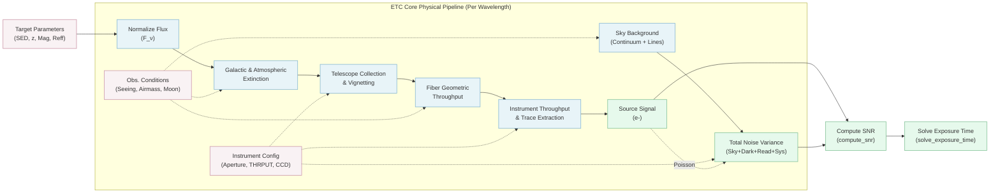

# JUST Exposure Time Calculator (ETC) Workflow

This compact flowchart illustrates the core physical modeling process within the JUST ETC engine, tracing from inputs to the final Signal-to-Noise Ratio calculation.

