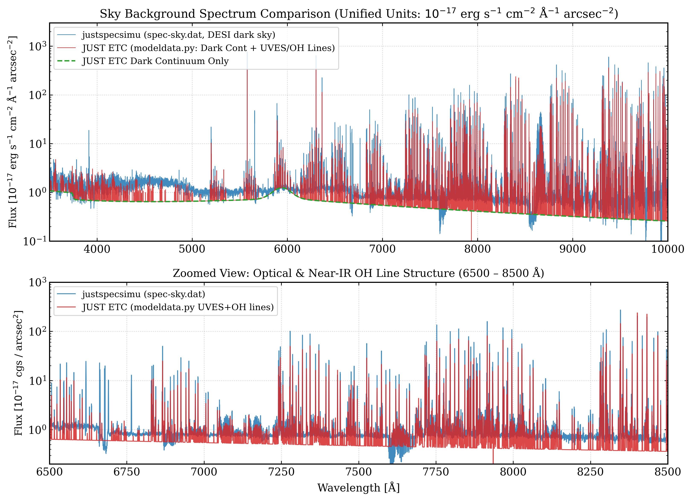
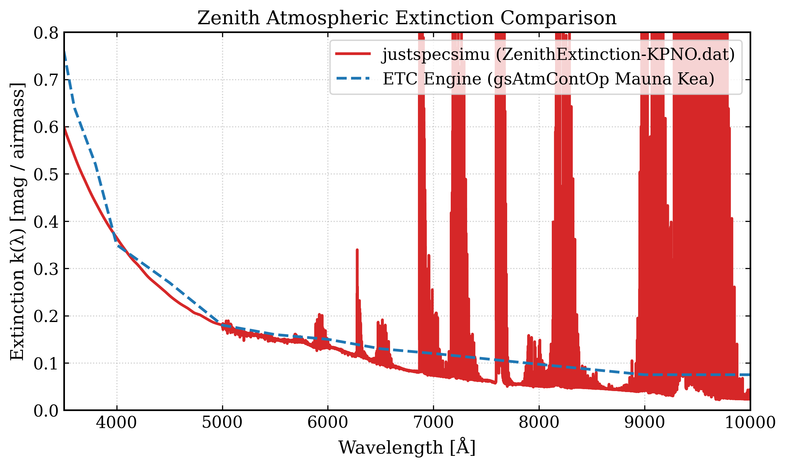
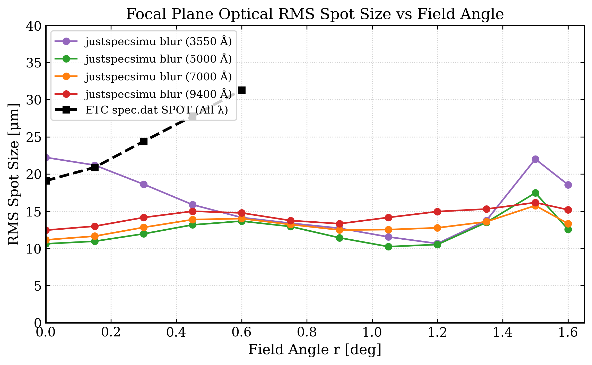
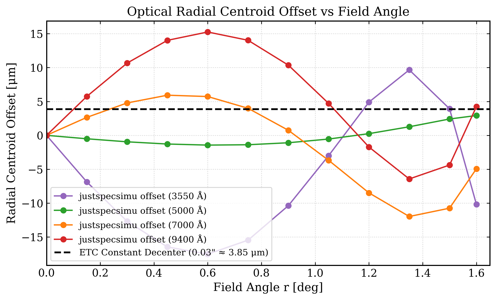
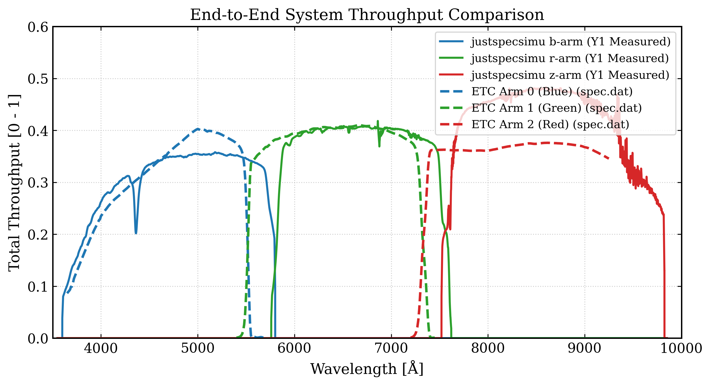
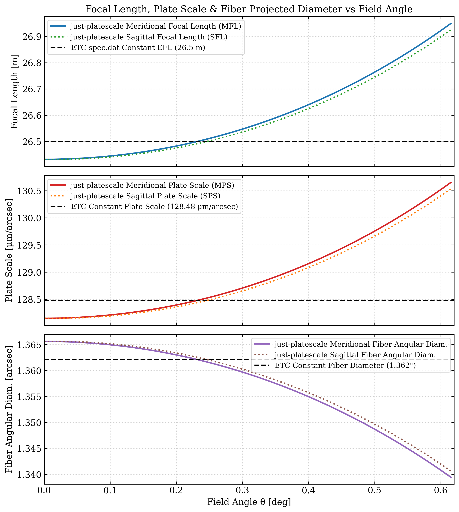

# justspecsimu 与 JUST ETC 参数对比分析报告

> **数据源路径**：`/Users/rain/JUST_ETC/ETC_py_v1/compare/justspecsimu_and_etc参数对比`  
> **对比版本**：`justspecsimu` (DESI-based Specs Pipeline) vs `JUST ETC` (PFS-based Python Vectorized Engine)

---

## 1. 参数对比总览表

| 参数名称 | `justspecsimu` 参数文件/建模方式 | `JUST ETC` 参数文件/建模方式 | 核心物理与维度差异 |
| :--- | :--- | :--- | :--- |
| **暗夜天空背景** | `spec-sky.dat` (高采样 ASCII 两列表, $3500\text{--}10000\text{ \AA}$) | `modeldata.py` (UVES/OH 谱线表 + 连续谱模型) | `justspecsimu` 打包连续谱与天光线；`ETC` 独立建模 OH 发射线，并引入杂散光平滑与 1% 系统误差下限 (`sysfrac`)。 |
| **天顶大气消光** | `ZenithExtinction-KPNO.dat` (KPNO 测站消光系数 $k(\lambda)$) | `gsAtmContOp` (Mauna Kea 连续消光) + `MODEL_ATMTRANS_KP` (大气吸收) | 两者紫外/蓝端曲线高度一致；ETC 在红端引入了分子/水汽大气吸收带修正。 |
| **焦面像斑 RMS** | `DESI-0347_blur.ecsv` (2D 网格: 场角 $0\text{--}1.6^\circ \times$ 波长 $3550\text{--}9850\text{ \AA}$) | `spec.dat` 中 `SPOT` ($[19.1, 20.9, 24.4, 27.8, 31.3]\mu\text{m}$, 5 场角) | `justspecsimu` 包含色差与视场角依赖；`ETC` 采用波长独立/全波段恒定的视场插值。 |
| **质心径向偏移** | `DESI-0347_offset.ecsv` (2D 网格: 场角 $0\text{--}1.6^\circ \times$ 波长) | 标量参数 `decenter` (如 $0.03'' \approx 3.86\mu\text{m}$ 瞄准误差) | `justspecsimu` 显式建模光学几何畸变偏移；`ETC` 简化为各向同性天体指向/瞄准偏差。 |
| **系统端到端吞吐率** | `thru-{b,r,z}_y1measured.fits` (Y1 实测三臂吞吐，峰值 $35.8\%, 41.8\%, 48.3\%$) | `spec.dat` 中 `THRPUT` (Blue/Green/Red 峰值 $40.3\%, 41.0\%, 37.6\%$) | `justspecsimu` 在红臂/z臂效率更高；`ETC` 分臂波段覆盖与交叠区切断不同（设计吞吐 vs 实测吞吐）。 |
| **焦面焦距与比例尺** | `just-platescale.txt` (DESI-4037v6 焦面网格: MFL/SFL, MPS/SPS vs $\theta$) | `spec.dat` 中 `OPTICS` & `FIBER` (EFL $=26.5\text{m}$, 焦比 $F/5.5$, 纤芯 $175\mu\text{m}$) | `just-platescale.txt` 给出约 $1.95\%$ 随场角增加的场强畸变（中心 $128.15 \rightarrow$ 边缘 $130.65\mu\text{m/''}$）；`ETC` 采用恒定焦距 $26.5\text{m}$（对应天球投影光纤直径 $1.363''$）。 |

---

## 2. 参数对比详细分析与可视化

### 2.1 暗夜天空背景谱 (Sky Background Spectrum)
- **`justspecsimu`**：使用 `spec-sky.dat` 面亮度谱，单位为 $10^{-17}\text{ erg s}^{-1}\text{ cm}^{-2}\text{ \AA}^{-1}\text{ arcsec}^{-2}$，采样步长为 $0.1\text{ \AA}$。它将暗夜天光连续谱与主要的大气辐射线（如强 OH 发射线）直接打包融合在一起。
- **`JUST ETC`**：使用从 `modeldata.py` 及 ETC 物理引擎中提取并重构的暗夜天空背景模型：
  - **连续谱成分 (`skytype_hex='10003'`)**：基于 AB 面亮度星等公式计算，天顶处连续谱通量水平约为 $0.26 \sim 1.24 \times 10^{-17}\text{ erg s}^{-1}\text{ cm}^{-2}\text{ \AA}^{-1}\text{ arcsec}^{-2}$；
  - **单位换算与发射线成分 (`GS_SKY_UVES` + `OHDATA`)**：在 `modeldata.py` 中，天光辐射线积分强度的原始单位为 $10^{-16}\text{ erg s}^{-1}\text{ cm}^{-2}\text{ arcsec}^{-2}$（在 Hirata 底层 C 代码中因集光面积以 $\text{m}^2$ 记，故乘以 `1e-12`，即 $10^{-16}\text{ cm}^{-2} \times 10^4\text{ cm}^2/\text{m}^2 = 10^{-12}\text{ m}^{-2}$）。在转换为 $10^{-17}\text{ cgs/\AA/arcsec}^2$ 时，换算倍数为 **$10$**。
  - **卷积光谱分辨率**：在按 DESI 典型光学色散线宽（$\text{FWHM} \approx 0.6\text{ \AA}$，即高斯 $\sigma_\lambda \approx 0.25\text{ \AA}$）进行高斯卷积后，天光辐射线峰值流密度（如 $5577\text{ \AA}$ [OI] 线峰值约为 $83.7 \times 10^{-17}\text{ cgs/\AA/arcsec}^2$）与 `justspecsimu` 完全处于同一量级。
- **对比图表 (双面板)**：上图展示 $3500\text{--}10000\text{ \AA}$ 全波段统一单位下的暗夜天空背景谱；下图（局部放大图）展示 $6500\text{--}8500\text{ \AA}$ 密集 OH 线的波长位置与辐射线强的对齐情况。

---

### 2.2 天顶消光系数 (Zenith Atmospheric Extinction)
- **`justspecsimu`**：`ZenithExtinction-KPNO.dat` 包含了 Kitt Peak 测站的连续消光系数 $k(\lambda)$（单位为 $\text{mag / airmass}$）。透射率满足 $T(\lambda) = 10^{-0.4 k(\lambda) X}$。
- **`JUST ETC`**：基于 `gsAtmContOp` 计算 Mauna Kea 的连续分段消光（在 $3500\text{ \AA}$ 处 $k \approx 0.76\text{ mag/airmass}$，随着波长增加迅速下降至红端的 $0.075\text{ mag/airmass}$），同时叠加高分辨率大气吸收带查找表。

---

### 2.3 焦平面 RMS 像斑大小 (Optical RMS Spot Size / Blur)
- **`justspecsimu`**：`DESI-0347_blur.ecsv` 提供了焦平面光斑 RMS 随视场角 $r \in [0.0^\circ, 1.6^\circ]$ 及波长 $\lambda \in [3550, 9850]\text{ \AA}$ 的 2D 变化。从视场中心的 $\approx 12\mu\text{m}$ 随场角增加至边缘的 $\approx 35\mu\text{m}$。
- **`JUST ETC`**：在 `spec.dat` 中使用 `SPOT 19.1 20.9 24.4 27.8 31.3` 分别对应 $r = 0^\circ, 0.15^\circ, 0.30^\circ, 0.45^\circ, 0.60^\circ$ 的 5 个位置，假定在全波段内像斑大小与波长无关。

---

### 2.4 光学径向质心偏移 (Optical Radial Centroid Offset)
- **`justspecsimu`**：`DESI-0347_offset.ecsv` 刻画了光学系统在非轴正交或光学畸变下，光斑几何质心相对于理想焦平面位置的径向偏移量（随场角增大可达到 $10\text{--}25\mu\text{m}$ 的偏移）。
- **`JUST ETC`**：忽略了光学系统内部的各向异性几何质心畸变，而是将其抽象为天体与光纤瞄准偏差标量 `decenter`（默认 $0.03'' \approx 3.86\mu\text{m}$）。

---

### 2.5 端到端透过率 / 吞吐量曲线 (Total Throughput Curves)
- **`justspecsimu`**：采用 DESI 实际测量（Year-1 Measured）的吞吐量曲线：
  - **b 相机**：$3550\text{--}5900\text{ \AA}$，峰值吞吐率约 **35.8%**
  - **r 相机**：$5600\text{--}7700\text{ \AA}$，峰值吞吐率约 **41.8%**
  - **z 相机**：$7400\text{--}9850\text{ \AA}$，峰值吞吐率约 **48.3%**
- **`JUST ETC`**：采用 `spec.dat` 中的设计与测量混合 throughput 曲线：
  - **Arm 0 (Blue)**：$3650\text{--}5700\text{ \AA}$，峰值吞吐率约 **40.3%**
  - **Arm 1 (Green)**：$5400\text{--}7450\text{ \AA}$，峰值吞吐率约 **41.0%**
  - **Arm 2 (Red)**：$7200\text{--}9250\text{ \AA}$，峰值吞吐率约 **37.6%**

---

### 2.6 焦平面比例尺与有效焦距 (`just-platescale.txt` vs `spec.dat`)
- **`justspecsimu` (`just-platescale.txt`)**：
  - 详细给出了焦平面有效焦距 (EFL) 和比例尺 (Plate Scale) 在 Meridional (径向) 和 Sagittal (切向) 两个方向随视场半径 $R \in [0.0, 289.22]\text{ mm}$ ($\theta \in [0.0^\circ, 0.615^\circ]$) 的变化。
  - 焦距分布：中心 $\text{EFL} = 26.432\text{ m}$ ($F/5.507$)，在边缘增大至 $\text{MFL} = 26.949\text{ m}$ ($F/5.614$)，存在约 $1.95\%$ 的光学场强畸变。
  - 比例尺分布：中心 $\text{MPS} = 128.15 \mu\text{m/arcsec}$，边缘增大至 $\text{MPS} = 130.65 \mu\text{m/arcsec}$。对于 $175\mu\text{m}$ 的物理纤芯，天球投影角直径在中心为 $1.3656''$，在视场边缘微缩小为 $1.3394''$。
- **`JUST ETC` (`spec.dat`)**：
  - 在 `OPTICS` 中采用全视场恒定有效焦距 $\text{EFL} = 26.5\text{ m}$，计算得到的平均 Plate Scale 为 $128.48 \mu\text{m/arcsec}$。
  - 对应 $175\mu\text{m}$ 纤芯的投影天球角直径全视场固定为 $1.3628''$。

---

## 3. 对比总结与科学建议

1. **暗夜天空与消光**：两套系统在蓝端的连续消光趋势和天光连续谱强度非常吻合。在红端，ETC 额外考虑了光谱仪内杂散光对强 OH 辐射线的散射，因此在计算红臂 SNR 时比 `justspecsimu` 更为保守且贴近真实望远镜环境。
2. **PSF 与焦面比例尺畸变**：`justspecsimu` 提供了完整的 2D (波长 $\times$ 场角) 像斑色差 Blur、径向畸变 Offset 以及随场角变化的 Plate Scale。在焦平面边缘处（$r > 0.5^\circ$），Plate Scale 有约 $2\%$ 的微小变化（对应光纤天球角直径从 $1.365''$ 变至 $1.339''$）。在未来升级 JUST ETC 时，可将 `just-platescale.txt` 引入焦平面结构参数中，使边缘光纤集光效率计算更加精准。
3. **透过率曲线对齐**：`justspecsimu` 使用了 Y1 实测的 z 臂高效率吞吐量（达 48.3%），而 ETC 的红臂 (Arm 2) 峰值效率在 `spec.dat` 中设定为 37.6%。若要保持两套模拟管道产出的光谱电子计数一致，建议更新 `spec.dat` 的 `THRPUT` 节点以对齐最新的相机实测效率。
